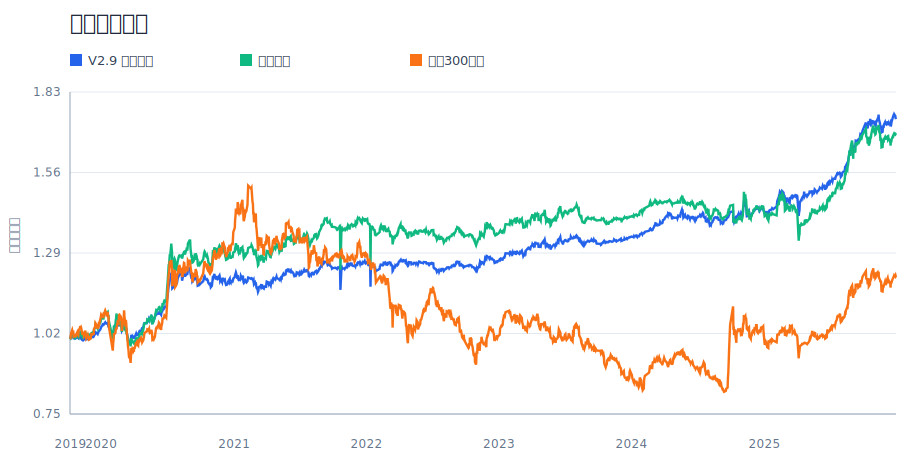
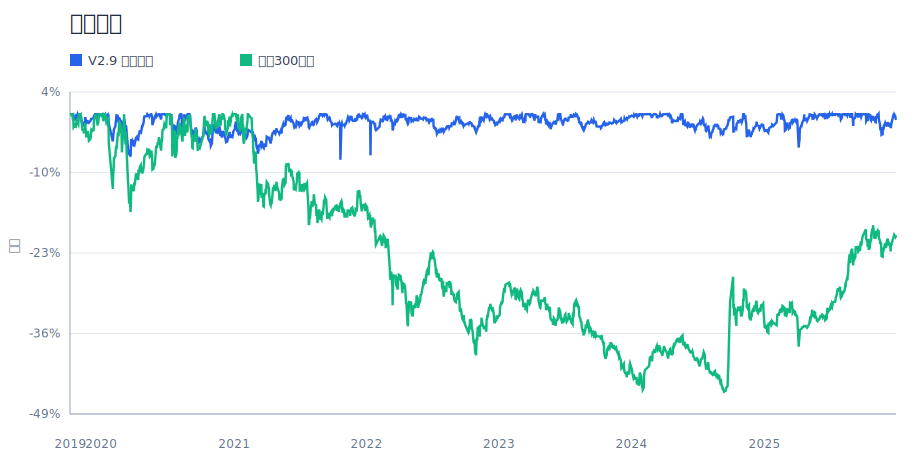
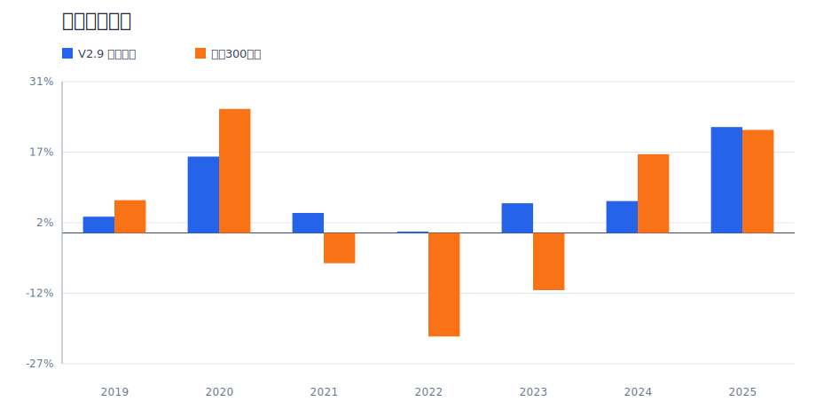
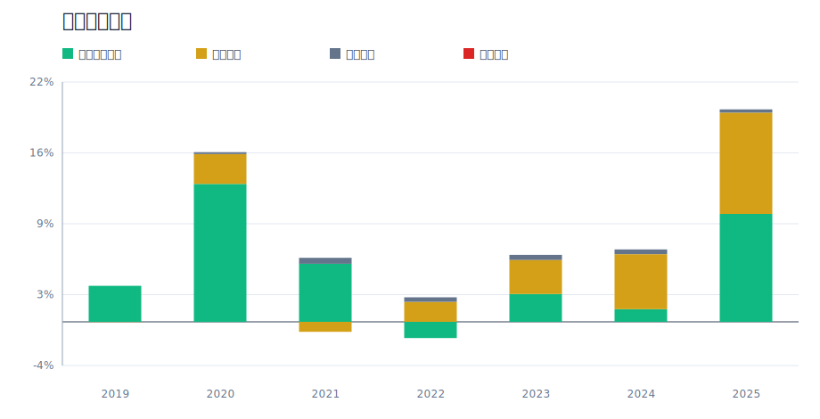

# 面向普通家庭的 ETF 核心-卫星组合构建与回测

## 摘要

本文构建一个面向普通家庭的 ETF 核心-卫星资产配置策略。研究目标不是寻找单一年份收益最高的组合，而是在普通家庭可承受的回撤、低频调仓和可解释资产配置约束下，提高组合的风险调整后收益。最终候选 V2.9 采用 60% 风险策略、20% 黄金 ETF、20% 短债 ETF 的结构，其中风险策略负责收益来源，黄金和短债负责降低组合深回撤。

在 2019-2024 年开发样本中，V2.9 年化收益为 +7.09%，最大回撤为 -7.48%，夏普比率为 0.524；在未参与参数选择的 2025 年样本外区间中，策略年化收益为 +21.93%，最大回撤为 -5.48%，夏普比率为 2.218。样本外结果说明策略在 2025 年仍保持正收益和正超额，但由于 OOS 只有一年，且 2025 年同时包含权益与黄金偏强的市场环境，本文将其作为初步外推证据，而不是长期有效性的最终证明。正式解读时，2025 OOS 只能回答“开发期结束后是否立即失效”，不能回答“未来多轮牛熊是否持续有效”。

## 1. 研究问题与设计

本文对应 B2 题目，核心问题是：能否构建一个普通家庭可以理解、可以执行、并且在风险收益上优于单一宽基持有的 ETF 组合策略。与单纯追求最高收益的择时模型不同，本文把最大回撤、调仓频率、标的可交易性和资产配置解释性作为同等重要的约束。

研究设计分为三步：第一，构建核心-卫星风险策略，用趋势和动量信号选择风险资产；第二，在风险策略外层加入黄金和短债防守仓，降低纯权益轮动的路径波动；第三，用样本外检验和压力测试检查最终方案是否过度依赖某一类资产或某一年市场环境。

### 1.1 文献与案例启发

本文没有直接复现某一篇复杂模型论文，而是采用投资实践中常见、可解释性较强的三类思想：第一，核心-卫星配置框架，用宽基和低相关资产承担组合底仓，再用主题 ETF 捕捉阶段性弹性；第二，时间序列动量和趋势过滤思想，用 MA200、20 日动量和 60 日动量减少弱势资产暴露；第三，风险预算思想，把普通家庭难以承受的权益轮动波动，通过黄金和短债防守仓进行外层缓冲。课程要求强调完整投资研究流程，因此本文重点放在数据、规则、回测、解释、样本外和风险反思的闭环，而不是追求黑箱预测模型复杂度。

## 2. 数据与样本划分

- 数据频率：ETF 日线收盘价。
- 风险资产：A 股宽基、行业主题 ETF、纳指 ETF 等。
- 防守资产：黄金 ETF `518880` 与 `511360` 短融ETF。
- 基准：沪深300指数/沪深300 ETF 口径。
- 开发样本：2019-2024，用于策略迭代、参数筛选和版本选择。
- 样本外区间：2025，仅用于最终候选的外推检验，不参与参数选择；本次数据口径覆盖至 2025-12-31。

为避免未来函数，所有信号只使用调仓日及之前可获得的数据。策略按月度检查和调仓，交易成本按单边万分之一计入。由于部分 ETF 成立时间较晚，实证起点由可用数据共同区间决定。

## 3. 策略方法

### 3.1 外层家庭组合

- 风险策略：60%
- 黄金 ETF：20%，标的 `518880`
- 现金/短债仓：20%，当前数据口径 `511360` 短融ETF

这个外层结构的作用是把风险预算分清楚：风险策略承担主要收益波动，黄金提供危机和通胀情景下的防守弹性，短债仓提供低波动缓冲。最终版本将黄金上限固定为 20%，是为了避免模型过度吃到 2019-2025 年黄金强势样本的红利。

### 3.2 风险策略内部规则

- 核心池：`510300` 沪深300、`510500` 中证500、`512890` 红利低波、`513100` 纳指。
- 卫星池：行业/主题 ETF 池中剔除核心标的和黄金。
- 市场状态：用沪深300 MA50/MA200 判断 bull、range、bear。
- 卫星选择：收盘价高于 MA200，20 日动量为正，再按 60 日动量排名取前 2。
- 风控规则：MA20 止损、沪深300单日大跌熔断、ATR 止盈和仓位偏离再平衡。

## 4. 回测设定与评价指标

本文主要评价指标包括年化收益、最大回撤、夏普比率、Calmar 比率、相对沪深300的超额年化收益，以及年度收益归因。对于普通家庭策略，最大回撤和 Calmar 比率尤其重要，因为策略即使长期收益较高，如果中途回撤过深，也很难被真实家庭账户长期坚持。

本文将 2019-2024 作为开发样本，2025 作为样本外区间。需要强调的是，2025 OOS 并不是重新调参后的结果，而是把开发样本中确定的 V2.9 权重和规则直接外推到 2025 年；本次报告的数据截止日为 2025-12-31。

### 4.1 交易成本与真实执行约束

回测按单边交易成本 0.01% 计入，风险策略内部交易由回测引擎处理，外层 60/20/20 家庭组合按月初再平衡后的权重漂移计算换手成本。由于 ETF 实盘还会受到冲击成本、买卖价差、流动性、折溢价、申赎限制、停牌/临停、调仓日成交可得性和个人账户费率影响，本文把交易成本结果视为保守但不完整的近似。若未来用于真实资金，应额外做不同滑点、买卖价差和资金规模下的容量测试，并优先检查短融 ETF 与行业主题 ETF 的成交额是否足以承载月度调仓。

## 5. 核心图表

下列图表对应最终报告中的核心结论：净值曲线用于观察长期累计收益，回撤曲线用于检查普通家庭是否可能坚持持有，年度收益和归因图用于判断收益是否集中在单一年份或单一资产。

## 6. 样本内结果

2019-2024 年，V2.9 在收益和回撤之间取得了较好的平衡：

| 区间 | 年化 | 最大回撤 | 夏普 | Calmar | 基准年化 | 超额年化 |
|---|---:|---:|---:|---:|---:|---:|
| 2019-2024 | +7.09% | -7.48% | 0.524 | 0.947 | +0.48% | +6.61% |

相对 V2.3a，V2.9 的主要提升不是简单提高风险仓位，而是通过外层黄金和短债仓降低路径波动。V2.3a 的最大回撤为 -15.21%，V2.9 降至 -7.48%；V2.3a 的夏普比率为 0.158，V2.9 提升至 0.524。

## 7. 样本外检验：2025 OOS

2025 年作为样本外区间，没有参与 V2.9 的参数选择。该检验的目的不是证明策略必然长期有效，而是检查策略在开发样本之后是否立即失效。

| 区间 | 年化 | 最大回撤 | 夏普 | Calmar | 基准年化 | 超额年化 |
|---|---:|---:|---:|---:|---:|---:|
| 2025 OOS | +21.93% | -5.48% | 2.218 | 3.999 | +21.33% | +0.59% |

OOS 结果显示，V2.9 在 2025 年实现正收益，并略微跑赢沪深300基准。更重要的是，最大回撤仍控制在 -5.48%，说明外层防守仓没有在样本外阶段失去控回撤作用。但 2025 年只有一年，且黄金在该阶段仍有较强贡献，因此本文将 OOS 结果解释为“通过初步外推检验”，而不是把它当作长期稳健性的充分证据。更严格地说，2025 OOS 只能说明策略没有在开发样本后的下一年立刻失效；若要证明长期稳健性，还需要未来继续滚动记录，或在更长历史、更丰富市场状态和更多防守资产替代口径下复核。

## 8. 对照组与版本选择

为了避免只展示最终版本，本文保留了从 V2.3a 到 V2.9 的迭代证据。关键对照如下：

| 版本 | 配置/变化 | 年化收益 | 最大回撤 | 夏普 | 选择判断 |
|---|---|---:|---:|---:|---|
| V2.3a | 原核心-卫星风险策略 | +5.05% | -15.21% | 0.158 | 作为风险策略基准，但回撤偏高 |
| V2.4-rc1 | 熊市恢复与熔断冷却微调 | +5.53% | -14.33% | 0.216 | 有改善，但幅度不足以解决家庭持有问题 |
| V2.7 60/30/10 | 60%风险 + 30%黄金 + 10%现金代理 | +8.25% | -8.26% | 0.613 | 指标更高，但黄金仓位偏重 |
| V2.9 60/20/20 | 60%风险 + 20%黄金 + 20%短债ETF | +7.09% | -7.48% | 0.524 | 最终主线，收益、回撤和解释性更均衡 |

V2.7 的 30% 黄金候选在回测中表现更强，但它更依赖黄金资产在样本期的强势表现。考虑到普通家庭策略不应把胜负过度押在单一资产上，最终选择 V2.9：黄金只保留 20% 上限，同时把 20% 配置到真实短融 ETF。

## 9. 稳健性分析

本文针对黄金依赖和防守仓收益假设做了压力测试。压力测试将黄金日收益按 100%、75%、50%、25%、0% 缩放，并把现金/短债收益设为 0%、1%、2%，观察不同候选在压力网格中的表现。

| 候选 | 压力网格最低达标数 | 4项全达标比例 | 最差年化 | 最差回撤 | 最差夏普 |
|---|---:|---:|---:|---:|---:|
| V2.7 实用候选 60/30/10 | 1 | 40.00% | +4.45% | -8.35% | 0.233 |
| V2.9 黄金上限 60/20/20 | 1 | 26.67% | +4.45% | -7.55% | 0.233 |
| V2.6 原候选 70/15/15 | 1 | 33.33% | +5.14% | -8.72% | 0.271 |
| V2.7 高黄金 55/45/0 | 2 | 60.00% | +4.10% | -10.50% | 0.209 |

压力测试的达标口径沿用家庭策略硬标准：年化收益不低于 6.5%、最大回撤不深于 -12%、夏普比率不低于 0.4、Calmar 不低于 0.6。

压力测试的主要结论是：高黄金仓位组合在原始样本中指标更好，但当黄金收益被打折后，收益目标会明显依赖黄金贡献。V2.9 的 20% 黄金上限降低了这种单一资产依赖，虽然牺牲了一部分高黄金版本的年化收益，但更适合作为普通家庭长期配置框架。

## 10. 年度归因

年度归因用于观察收益来源是否集中在少数年份或单一资产。表中风险策略、黄金和短债贡献相加后，再扣除调仓成本，形成组合年度收益。注意：本节表格中的 `portfolio_return` 和 `benchmark_return` 是对应自然年的实际总收益，不是前文 2025 OOS 表中的年化收益，因此数值会略有差异。

| year | portfolio_return | benchmark_return | risk_contribution | gold_contribution | defensive_contribution | fee_drag | max_drawdown |
|---|---|---|---|---|---|---|---|
| 2019 | +3.35% | +6.75% | +3.34% | -0.02% | +0.00% | -0.00% | -1.77% |
| 2020 | +15.70% | +25.51% | +12.81% | +2.77% | +0.17% | -0.00% | -6.96% |
| 2021 | +4.12% | -6.21% | +5.39% | -0.93% | +0.55% | -0.00% | -7.48% |
| 2022 | +0.29% | -21.27% | -1.51% | +1.85% | +0.43% | -0.00% | -6.55% |
| 2023 | +6.11% | -11.75% | +2.58% | +3.16% | +0.47% | -0.00% | -2.42% |
| 2024 | +6.57% | +16.20% | +1.18% | +5.10% | +0.44% | -0.00% | -3.79% |
| 2025 | +21.78% | +21.19% | +10.01% | +9.40% | +0.30% | -0.00% | -5.48% |

从年度结果看，V2.9 在 2022 年权益市场下跌时仍保持小幅正收益，说明黄金和短债防守仓在弱市中有实际贡献；2024 年和 2025 年黄金贡献较高，也提示本文不能忽视黄金强势样本带来的正向影响。

## 11. 题目要求问题回应

1. 投资对象：A 股 ETF、跨境 ETF、黄金 ETF 和短债 ETF，主要面向普通家庭账户。
2. 组合目标：在低频可执行的前提下，提高相对沪深300的风险调整后收益，并控制最大回撤。
3. 基准：沪深300指数/沪深300 ETF 口径，同时在研究过程中保留风险策略和早期版本作为内部对照。
4. 未来函数：所有趋势、动量和调仓信号只使用调仓日及之前的数据；2025 年仅用于最终候选的样本外检验。
5. 交易成本：回测计入单边 0.01% 交易成本；真实投资还需额外考虑滑点、申赎限制、折溢价、流动性和个人费率。
6. 样本内外一致性：2019-2024 样本内年化 +7.09%、最大回撤 -7.48%；2025 OOS 年化 +21.93%、最大回撤 -5.48%。方向上保持正收益和控回撤，但 OOS 时间较短。
7. 最赚钱和最差阶段：2025 年贡献最高，2021 年出现组合最大回撤；2022 年权益市场下跌时组合仍保持小幅正收益，是防守仓发挥作用的阶段。
8. 回测好看时最该怀疑：黄金在 2019-2025 样本中偏强、2025 OOS 只有一年、ETF 历史长度有限、部分 ETF 成立时间较晚，以及真实交易成本和成交约束可能高于回测假设。
9. 真实投入最大风险：黄金和短债的防守效果可能阶段性失效，权益反弹时策略可能跟不上，短融/行业 ETF 的成交额和买卖价差可能影响实际成交，且家庭投资者可能在回撤或相对落后阶段提前放弃。
10. 下一步改进：扩大样本外区间，引入更多防守资产和成本情景，比较多个基准，进一步做容量、滑点和真实账户可执行性测试。

## 12. 局限性

- 黄金在 2019-2025 样本中表现较强，因此最终版本设置 20% 黄金上限，避免策略过度依赖黄金。
- 现金/短债仓已替换为真实 ETF `511360` 短融ETF；后续若用于实盘，应继续检查流动性、费率、折溢价和申赎约束。
- 2025 OOS 只有一年，能够提供初步外推证据，但不能替代更长周期、多市场状态的样本外检验；报告中的 OOS 结论应限定为“开发期后一年未立即失效”。
- 回测使用日线收盘价和固定交易成本，真实执行还会受到流动性、冲击成本、买卖价差、申赎限制、折溢价、停牌/临停、调仓日成交可得性和个人税费影响。
- 策略以月度调仓为核心，适合低频家庭账户；若用于更高频或更大资金规模，需要重新评估交易容量。

## 13. 结论

本文最终选择 V2.9 作为大作业主线策略。该策略在 2019-2024 年开发样本中实现 +7.09% 年化收益、-7.48% 最大回撤和 0.524 夏普比率；在 2025 年样本外区间中继续保持正收益和正超额。相较早期纯风险策略，V2.9 的优势在于把收益来源和防守资产分层，让策略更接近普通家庭可以理解、可以执行、也更容易长期持有的配置方案。

本文结论不是“V2.9 已经证明未来一定有效”，而是：在当前数据和约束下，V2.9 是收益、回撤、解释性和可执行性之间最均衡的候选版本。后续研究应继续扩大样本外区间，并用真实交易约束检验该策略的可执行性。

## 14. 参考文献与资料说明

- 课程大作业题目：《人工智能与投资研究》大作业选题说明，B2 ETF 核心-卫星组合方向。
- 数据获取：AKShare 开源数据接口；本项目使用 ETF 日线价格、沪深300基准数据和货币/短债/国债 ETF 数据。
- 策略思想：核心-卫星资产配置、时间序列动量、移动均线趋势过滤、最大回撤控制和风险预算等投资研究常见方法。
- 开源工具：Python、pandas、numpy；最终 HTML 与 SVG 图表由本项目脚本生成，代码和结果表均保存在仓库中，便于复现。

## 15. AI 使用说明

本项目使用 OpenClaw 总控，并结合 Codex 与 Claude Code 辅助完成代码调试、回测脚本编写、策略报告整理、HTML 生成、SVG 图表生成、风险压力测试设计和文字结构化表达。策略判断、题目适配和最终取舍由研究者审阅确认。
